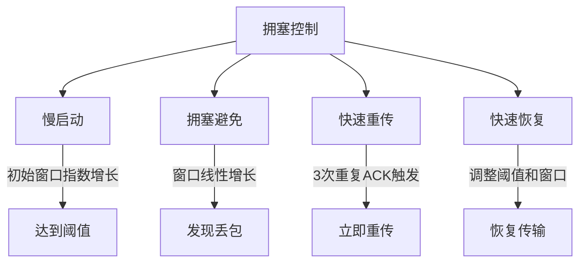

## 一. `TCP` 如何确保可靠性？

`TCP` 通过以下机制保障数据传输的可靠性：
- **序列号与确认应答**: 每个 `TCP` 段携带唯一序列号，确保数据按序到达; 接收方通过 `ACK` 确认已收到的数据段
- **数据校验和**: 使用校验和检测数据错误，错误数据包会被丢弃并触发重传
- **超时重传**: 发送方设置定时器，未收到 `ACK` 则重发数据
- **流量控制**: 通过滑动窗口动态调整发送速率
- **拥塞控制**: 自适应调节发送速率避免网络过载

---

### 二. 拥塞控制实现

---

| 阶段         | 机制描述                                                                 |
|--------------|--------------------------------------------------------------------------|
| **慢启动**   | 初始窗口从 `1 MSS` 开始，每收到 `ACK` 窗口指数增长，直到达到慢启动阈值（`ssthresh`） |
| **拥塞避免** | 窗口线性增长（每 `RTT` 增加 `1 MSS`），避免快速增长引发拥塞                    |
| **快速重传** | 收到 `3` 次重复 `ACK` 立即重传，无需等待超时                                  |
| **快速恢复** | 将 `ssthresh` 设为当前窗口一半，窗口调整为 `ssthresh + 3` MSS，继续拥塞避免    |

`TCP` 拥塞控制通过慢启动、拥塞避免、快速重传和快速恢复四个阶段，动态调整发送窗口大小，确保网络传输的可靠性和效率。

---
### 三. 流量控制实现
- 流量控制是确保发送方的发送速率不会超过接收方的处理能力，从而避免数据包丢失或缓冲区溢出的机制。`TCP` 通过滑动窗口机制实现流量控制，动态调整发送方的发送速率。
- **动态窗口调整**: 接收方通过 `window_size` 字段告知可用缓冲区空间, 发送方根据窗口值限制发送数据量
- **零窗口探测**: 当接收方窗口为 `0` 时，发送方定期发送探测报文
- **窗口缩放选项（`RFC 7323`）**: 支持扩大窗口范围至 `1GB`，适应高速网络

---

### 四. `UDP` 如何实现可靠传输？
`UDP` 原生特性
- 无连接：无握手过程，延迟低
- 无可靠性保证：不提供重传、拥塞控制等机制
- 典型应用场景：实时音视频、`DNS` 查询、在线游戏

| 机制           | 发送端实现                                                                 | 接收端实现                                                                 |
|----------------|--------------------------------------------------------------------------|--------------------------------------------------------------------------|
| **序列号管理** | 为每个数据包分配唯一序列号                                               | 按序接收并缓存乱序包                                                     |
| **确认机制**   | 收到 `ACK` 后发送下一包，未确认则启动重传定时器                            | 发送包含最高连续序列号的 `ACK `                                            |
| **超时重传**   | 动态计算 `RTO`（参考 `TCP` 的 `Jacobson` 算法），超时后重传并指数退避           | 检测重复包并丢弃                                                         |
| **流量控制**   | 根据接收方通告的窗口大小调整发送速率                                     | 通过 `ACK` 包反馈剩余缓冲区大小                                            |
| **拥塞控制**   | 实现类似 `TCP` 的 `AIMD` 策略（加法增大/乘法减小）                            | 通过丢包率反馈网络状态                                                 |
- 通过发送端和接收端的协同工作，可靠传输机制能够有效管理数据包的顺序、确认、重传、流量和拥塞，确保数据传输的可靠性和效率。
