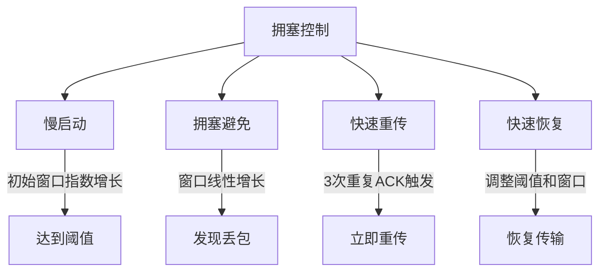

# TCP 与 UDP 可靠性传输机制

---

## 一、TCP 如何确保可靠性？

### 1. 核心机制
TCP 通过以下机制保障数据传输的可靠性：
- **序列号与确认应答**  
  - 每个 TCP 段携带唯一序列号，确保数据按序到达  
  - 接收方通过 ACK 确认已收到的数据段
- **数据校验和**  
  - 使用校验和检测数据错误，错误数据包会被丢弃并触发重传
- **超时重传**  
  - 发送方设置定时器，未收到 ACK 则重发数据
- **流量控制**  
  - 通过滑动窗口动态调整发送速率
- **拥塞控制**  
  - 自适应调节发送速率避免网络过载

---

### 2. 拥塞控制实现

