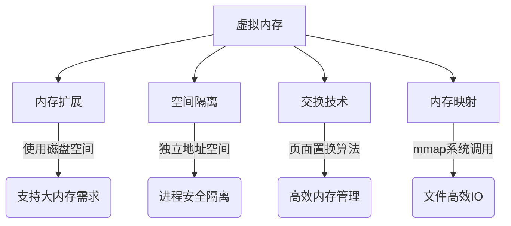

## 一. 死锁及其避免

### 1. 死锁定义
当多个进程因竞争资源而陷入相互等待的僵局时，每个进程都持有部分资源并等待其他进程释放所需资源，导致系统无法继续推进的状态。

### 2. 死锁必要条件
- **互斥条件**：资源同一时间只能被一个进程独占使用
- **请求保持条件**：进程已持有资源时仍可申请新资源
- **不可剥夺条件**：已分配资源不能被强制收回
- **循环等待条件**：存在进程间环形等待链

### 3. 死锁处理策略
| 方法         | 实现方式                                                                 | 典型方案                     |
|--------------|--------------------------------------------------------------------------|------------------------------|
| 预防死锁     | 破坏四个必要条件中的至少一个                                             | 有序资源分配法               |
| 避免死锁     | 动态检测资源分配状态                                                     | 银行家算法                   |
| 检测与恢复   | 定期检测死锁，通过进程终止或资源抢占恢复                                 | 资源剥夺法                   |

## 二. 典型锁机制

### 1. 基础锁类型
#### 互斥锁 (`Mutex`)
- 特点：阻塞式等待，上下文切换
- 适用场景：临界区执行时间较长
- 示例：`pthread_mutex_lock()`

#### 自旋锁 (`Spinlock`)
- 特点：忙等待（`while`循环检测），无上下文切换
- 适用场景：临界区非常短小
- 示例：`std::atomic_flag`

### 2. 高级锁类型
| 锁类型       | 特性                                                                 | 适用场景                     |
|--------------|----------------------------------------------------------------------|------------------------------|
| 读写锁       | 读共享/写独占，支持并发读                                            | 读多写少场景                 |
| 悲观锁       | 默认会发生冲突，先加锁再操作                                         | 数据库行锁                   |
| 乐观锁       | 先操作后检测冲突（`CAS`机制）                                          | 版本号控制                   |

## 三. 虚拟内存详解

### 1. 核心概念
通过页表将连续的虚拟地址空间映射到分散的物理内存与磁盘空间，为进程提供独立的内存视图。

### 2. 核心功能

