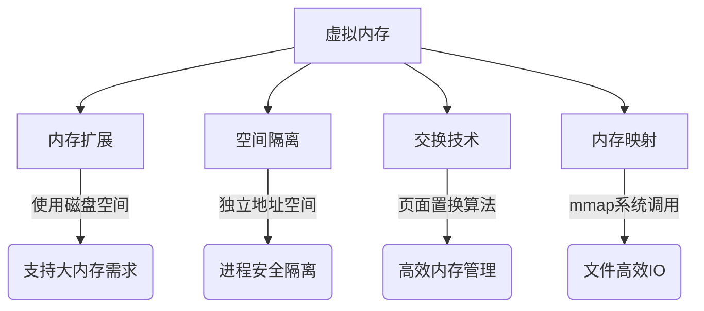

## 一. 死锁及其避免

### 1. 死锁定义
当多个进程因竞争资源而陷入相互等待的僵局时，每个进程都持有部分资源并等待其他进程释放所需资源，导致系统无法继续推进的状态。

### 2. 死锁必要条件
- **互斥条件**：资源同一时间只能被一个进程独占使用
- **请求保持条件**：进程已持有资源时仍可申请新资源
- **不可剥夺条件**：已分配资源不能被强制收回
- **循环等待条件**：存在进程间环形等待链

### 3. 死锁处理策略
| 方法         | 实现方式                                                                 | 典型方案                     |
|--------------|--------------------------------------------------------------------------|------------------------------|
| 预防死锁     | 破坏四个必要条件中的至少一个                                             | 有序资源分配法               |
| 避免死锁     | 动态检测资源分配状态                                                     | 银行家算法                   |
| 检测与恢复   | 定期检测死锁，通过进程终止或资源抢占恢复                                 | 资源剥夺法                   |

---

## 二. 典型锁机制

### 1. 基础锁类型
#### 互斥锁 (`Mutex`)
- 特点：阻塞式等待，上下文切换
- 适用场景：临界区执行时间较长
- 示例：`pthread_mutex_lock()`

#### 自旋锁 (`Spinlock`)
- 特点：忙等待（`while`循环检测），无上下文切换
- 适用场景：临界区非常短小
- 示例：`std::atomic_flag`

### 2. 高级锁类型
| 锁类型       | 特性                                                                 | 适用场景                     |
|--------------|----------------------------------------------------------------------|------------------------------|
| 读写锁       | 读共享/写独占，支持并发读                                            | 读多写少场景                 |
| 悲观锁       | 默认会发生冲突，先加锁再操作                                         | 数据库行锁                   |
| 乐观锁       | 先操作后检测冲突（`CAS`机制）                                          | 版本号控制                   |

---

## 三. 虚拟内存详解

### 1. 核心概念
通过页表将连续的虚拟地址空间映射到分散的物理内存与磁盘空间，为进程提供独立的内存视图。

### 2. 核心功能

### 需要虚拟内存的原因：

- **内存扩展**：虚拟内存使得每个程序都可以使用比实际可用内存更多的内存，从而允许运行更大的程序或处理更多的数据。
- **内存隔离**：虚拟内存提供了进程之间的内存隔离。每个进程都有自己的虚拟地址空间，因此一个进程无法直接访问另一个进程的内存。
- **物理内存管理**：虚拟内存允许操作系统动态地将数据和程序的部分加载到物理内存中，以满足当前正在运行的进程的需求。当物理内存不足时，操作系统可以将不常用的进程或程序暂时移到硬盘上，从而释放内存，以便其他进程使用。
- **页面交换**：当物理内存不足时，操作系统可以将一部分数据从物理内存写入到硬盘的虚拟内存中（页面交换）。当需要时，数据可以再次从虚拟内存中加载到物理内存，保证系统继续运行。
- **内存映射文件**：虚拟内存可以用于将文件映射到内存中，使得文件的读取和写入可以像访问内存一样高效。

### 多级页表
- **层级分页结构**：将线性地址分割为多段索引（如`x86_64`采用`PML4/PDPT/PD/PT`四级页表）
- **动态页表加载**：仅维护实际使用的页表层级，未访问的页表不占用物理内存
- **空间压缩**：`64`位系统下，单级页表需占用`512GB`空间，四级页表仅需`4KB~2MB`
- **权限控制**：支持页级读写/执行权限管理（`RWX`标志位）
- **内存隔离**：不同进程的页表完全独立
- `x86`架构：`CR3`寄存器存储顶级页表基址
- `ARM`架构：采用两级或三级页表（`TTBR0/TTBR1`）

### `TLB`快表
- **并行查询**：`CPU`同时发起`TLB`查询和页表遍历（`Page Walk`）
- **多级缓存**：现代`CPU`包含`L1 TLB`（指令/数据分离）和`L2 TLB`（统一缓存）
- **地址空间标识**（`ASID`）：支持不同进程的`TLB`项共存

### 写时复制（`Copy-on-Write`）
1. **进程创建**：`fork()`时父子进程共享所有物理页
2. **权限设置**：内核将共享页标记为只读（`Read-Only`）
3. **写操作触发**：
   - `CPU`检测到写操作违反页权限
   - 触发缺页异常（`Page Fault`）
4. **页复制**：
   - 内核分配新物理页
   - 复制原页内容到新页
   - 更新故障进程的页表项
5. **权限恢复**：新页标记为可写
